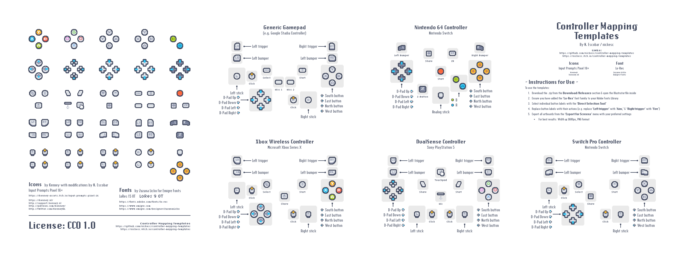

<h3 align="center" >
  <!--
  itch color: #fa5c5c
  github color: brightgreen
  label color: #505050
  mastodon color: #6364FF
  -->

  

    
    
  

   
  
  <h6 align="center">
    simple templates to create controller 
    mapping images for a number of gamepads
  </h6>
  <h6 align="center">
    by <a href="https://nickesc.github.io">N. Escobar</a> / <a href="https://github.com/nickesc">nickesc</a>
      
    
  </h6>
  
</h3>

## Overview
<b>Controller Mapping Templates</b> are useful for game developers that want an easy way to build images of controller mappings. Using these templates for your project can be as simple as editing the text and exporting to an image.

These templates can be used in-game, in manuals, on README documents, or anywhere else you want to show players how to use your game with a controller. All elements have a white backdrop to allow for placement on light or dark surfaces.

### Currently Supported:

<h4>Xbox Wireless Controller</h4>

<h4>DualSense Controller</h4>

<h4>Switch Pro Controller</h4>

<h4>Generic Gamepads</h4>

<h4>Nintendo 64 Controller</h4>

## Instructions

### Requirements
- active <b>Adobe Creative Cloud subscription</b>
- <b>Adobe Illustrator</b>
- [LoRes font](https://fonts.adobe.com/fonts/lo-res) in your Adobe Font Library

To use the templates:
1. Download the .zip from the [Download/Releases section](https://github.com/nickesc/controller-mapping-templates/releases) & open the `templates.ai` Illustrator file inside
2. Ensure you have added the <b>'LoRes'</b> font family to your Adobe Fonts Library
3. Select individual button labels with the `Direct Selection Tool`
4. Replace button labels with their actions (e.g. replace <b>'Left trigger'</b> with <b>'Aim,'</b> & <b>'Right trigger'</b> with <b>'Fire'</b>)
5. Export all artboards from the `Export for Screens` menu with your preferred settings 
   - For best results: `Width @ 3600px, PNG format`

## Credits

### Icons

#### [Input Prompts Pixel 16× (1.0)](https://kenney-assets.itch.io/input-prompts-pixel-16)
> - Created/distributed by Kenney ([www.kenney.nl](https://www.kenney.nl))
> - Creation date: 23-09-2021
> 
> License: [Creative Commons Zero, CC0](https://creativecommons.org/publicdomain/zero/1.0/)
>
> This content is free to use in personal, educational and commercial projects.
>
> - Donate:   [https://support.kenney.nl](https://support.kenney.nl)
> - Patreon:  [https://patreon.com/kenney/](https://patreon.com/kenney/)
>
> Follow on Twitter for updates:
> - [https://twitter.com/KenneyNL](https://twitter.com/KenneyNL)

### Fonts

#### [Lo-Res](https://fonts.adobe.com/fonts/lo-res)
> LoRes 15 & LoRes 9
> - Designed by Zuzana Licko ([www.zuzanalicko.com](https://www.zuzanalicko.com/)) for [Emigre Fonts](https://www.emigre.com/)
> - Created in 1985 and 2001
>
> Licensed under [Adobe Fonts](https://helpx.adobe.com/fonts/using/font-licensing.html)
>
> No fonts are embedded in this project. All fonts must be accessed through the user's Creative Cloud subscription and their Adobe Fonts Library.

## License

All elements of this project that have been created by me are available under the [Creative Commons CC0 1.0 Universal](/LICENSE) license; you are free to use images generated using these templates in any other project (personal, educational or commercial), without condition or requirement for attribution.

If you want to credit this project, you can include some text like this:
> Controller mappings created with Controller Mapping Templates (nickesc.itch.io/controller-mapping-templates) provided by N. Escobar (github.com/nickesc)
